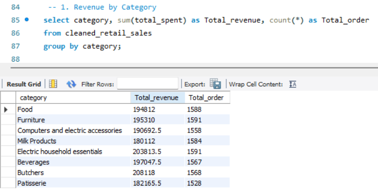
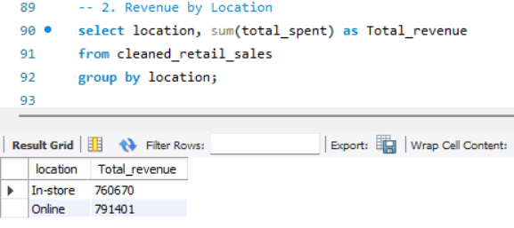
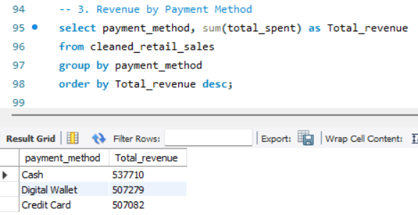
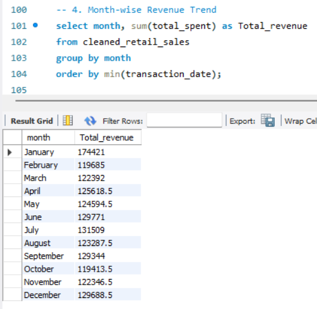
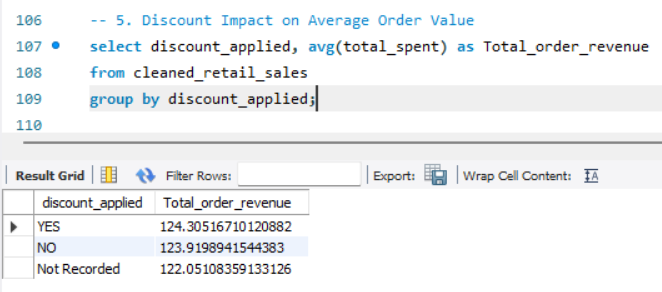
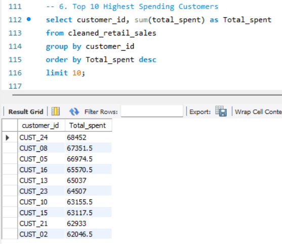
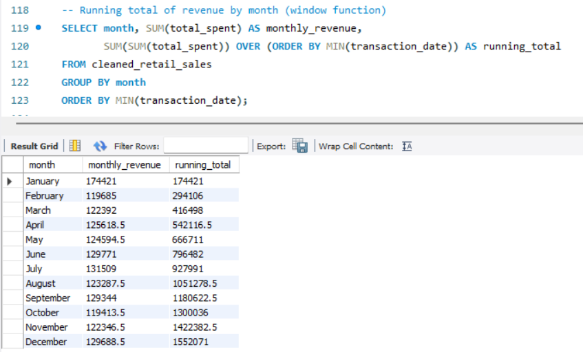
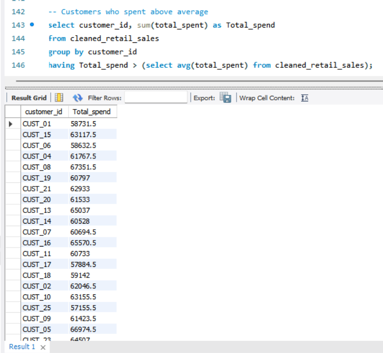

# Retail Sales SQL Analysis

## 📌 Problem Statement
Analyzed 12,575 retail sales transactions using MySQL — cleaning messy 
data (missing values, inconsistent date formats) and deriving business 
insights through SQL queries. This project extends my earlier Excel-based 
analysis of the same dataset, applying the same logic using SQL 
(CASE WHEN, Views, Aggregate functions, Window functions).

Dataset source: [Kaggle - Dirty Retail Store Sales](https://www.kaggle.com/datasets/ahmedmohamed2003/retail-store-sales-dirty-for-data-cleaning)

## 🗄️ Database Setup
- Imported raw CSV into a staging table (all VARCHAR) to avoid import 
  errors from inconsistent date formats and blank numeric fields
- Transformed into a properly-typed `retail_sales` table using 
  `STR_TO_DATE()` and `NULLIF()`
- Built a `cleaned_retail_sales` VIEW applying cleaning logic (equivalent 
  to Excel's Raw → Cleaned sheet separation)

## 🧹 Data Cleaning Logic
- **Item** — NULL values labeled "Unknown Item"
- **Price Per Unit** — preserved when already present; only recalculated 
  as `Total ÷ Quantity` when missing AND both Quantity & Total are available
- **Quantity / Total Spent** — when both missing together, flagged as 
  unrecoverable (cannot solve one equation with two unknowns)
- **Discount Applied** — blanks labeled "Not Recorded" instead of assuming 
  "No", to avoid bias in discount-impact analysis
- Added a `data_quality_flag` column to track row-level completeness

## 🧠 SQL Concepts Applied
- **CASE WHEN** — replicates Excel's IF-logic for cleaning
- **Views** — separates raw vs. cleaned data
- **Aggregate functions** — SUM, COUNT, AVG with GROUP BY
- **Window functions** — `SUM() OVER()` for running monthly revenue total
- **Subqueries + HAVING** — filtering customers by aggregated spend
- **NULLIF / STR_TO_DATE** — data type transformation during import

## 📊 Analysis & Results

### 1. Revenue by Category

Butchers generated the highest revenue (₹2,08,118) among all 8 categories.

### 2. Revenue by Location

Online (₹7,91,401) slightly outperformed In-store (₹7,60,670) — a fairly 
balanced split.

### 3. Revenue by Payment Method

Cash was the most-used payment method by total revenue (₹5,37,710), 
ahead of Digital Wallet and Credit Card.

### 4. Month-wise Revenue Trend

January showed a notably higher total than other months.

### 5. Discount Impact on Average Order Value

Discounted orders averaged ₹124.31 vs ₹123.92 for non-discounted — 
minimal difference, suggesting discounts may not meaningfully drive 
larger purchases.

### 6. Top 10 Highest Spending Customers

CUST_24 was the highest spender (₹68,452), followed by CUST_08 and CUST_05.

### 7. Running Total of Revenue by Month (Window Function)

Used `SUM() OVER (ORDER BY ...)` to track cumulative revenue across 
months without collapsing individual month rows — total revenue for the 
year reached ₹15,52,071 by December.

### 8. Customers Who Spent Above Average

Used a subquery with `HAVING` to filter customers whose total spend 
exceeds the overall average order value — identifies high-value customers 
for targeted marketing or loyalty programs.

## 💡 Challenges & Learnings
- **Import errors**: Mixed date formats (DD-MM-YYYY) and blank numeric 
  fields caused import failures. Solved using a VARCHAR staging table, 
  then transforming with `STR_TO_DATE()` and `NULLIF()`.
- **Excel-to-SQL logic gap**: My earlier Excel formula always recalculated 
  Price as `Total ÷ Quantity`, even when Price already existed — causing 
  valid prices to be lost when Quantity/Total were missing. Fixed in SQL 
  by checking `IS NULL` before recalculating.
- **Window functions**: Learned the difference between a normal aggregate 
  (`GROUP BY`, which collapses rows) and a window function (`OVER()`, 
  which keeps every row while adding a running calculation).

## 🛠️ Tools Used
MySQL Workbench, SQL (CASE WHEN, Views, Window Functions, Subqueries, 
Aggregate Functions)

## 📁 Files
- `retail_store_sales.csv` — original raw dataset
- `retail-sales-queries.sql` — all SQL queries (setup, cleaning, analysis)
- `screenshots/` — query results

## 🔗 Related Project
Excel-based analysis of the same dataset: [Link to your Excel repo]
